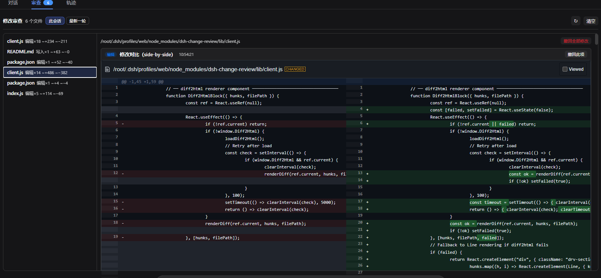
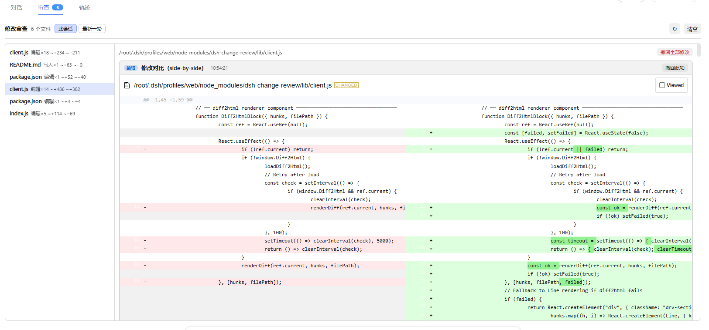

# dsh-change-review

DeepSeek Harness 会话修改审查插件 — 追踪 write/edit 工具调用，展示 VS Code 风格的 side-by-side diff 对比。

> 基于 [dsh-change-review](https://github.com/cirelir/dsh-change-review) 修改，集成 diff2html 实现更好的 diff 体验。

[English](#features) | 中文说明

## ✨ 特性

| 功能 | 说明 |
|------|------|
| 自动追踪 | 监听 write/edit 工具调用，记录修改前后的内容和时间戳 |
| Side-by-Side Diff | 集成 diff2html，VS Code 风格的并排对比视图 |
| 主题自动跟随 | 自动适配系统深色/浅色主题，无需手动配置 |
| 语法高亮 | 支持代码语法高亮显示 |
| 会话隔离 | 每个会话只显示自己的修改 |
| 子代理聚合 | 子代理的修改会汇总到父会话 |
| 实时推送 | SSE 实时更新修改状态 |
| 一键撤回 | 支持单个修改或整个文件的撤回 |
| 编辑器集成 | 支持在 VS Code、Cursor 等编辑器中打开文件 |

## 📦 安装

```bash
# 从 GitHub 安装
dsh plugin --profile web add github:xwh5/dsh-change-review
```

安装后刷新网页即可使用。

## 🚀 使用

1. 打开 DSH Web 界面
2. AI 执行 write/edit 工具修改文件后
3. 点击对话上方的「审查」标签查看修改
4. 支持「此会话」和「最新一轮」两种视图

## 📸 截图

> 以下为插件在 DSH Web 界面中的实际效果截图。





## 📁 文件结构

```
dsh-change-review/
├── lib/
│   ├── index.js          # 后端：工具执行监听、HTTP 路由
│   ├── client.js         # 前端：React 组件、diff2html 渲染
│   └── vendor/
│       ├── diff2html.min.js
│       ├── diff2html-ui.min.js
│       └── diff2html.min.css
├── docs/
│   └── screenshots/      # 界面截图（见上方「截图」）
├── cordis.patch.yml
├── package.json
└── README.md
```

## 🙏 致谢

- 原项目：[dsh-change-review](https://github.com/cirelir/dsh-change-review) by cirelir
- Diff 库：[diff2html](https://github.com/rtfpessoa/diff2html) by rtfpessoa

## 📄 License

MIT
